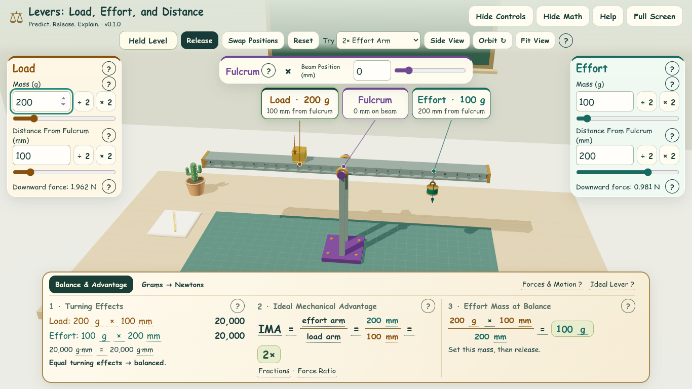
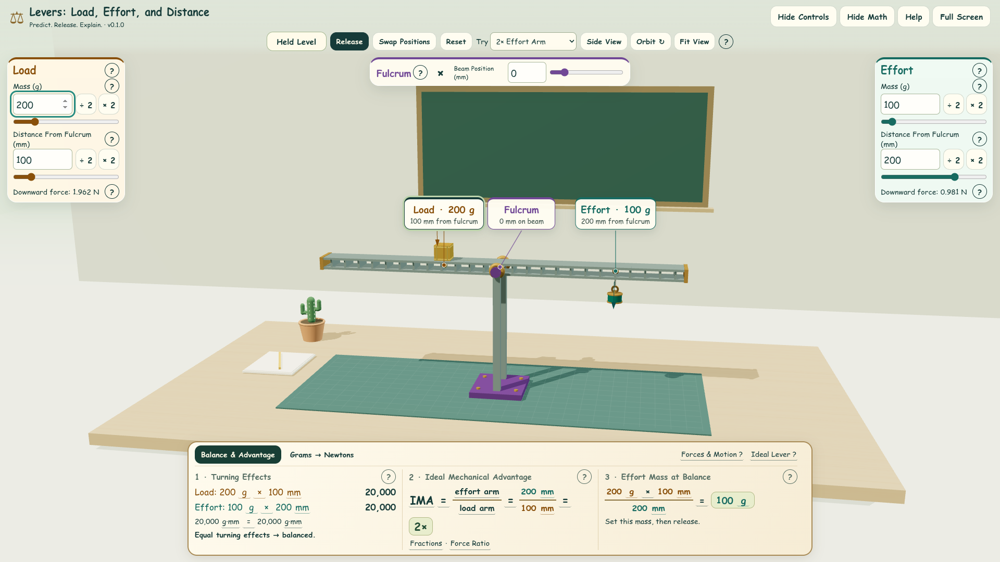
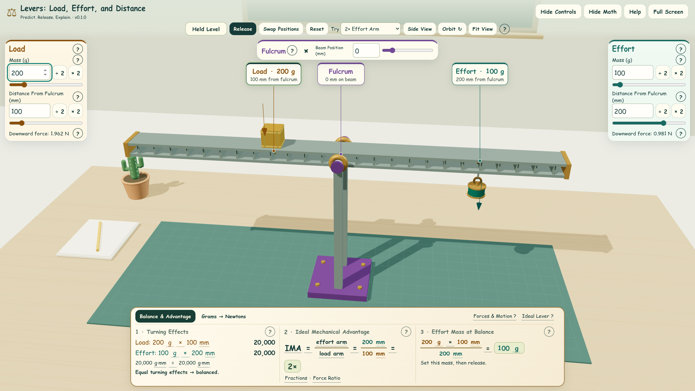

# Camera Framing Review

Implements [Issue #10](https://github.com/AbbyUsesAIThatCodes/LeversLoadEffortDistance/issues/10)
on top of the merged control layout, seated Load, and compact tooltip work.

## Framing and Interaction

The orbit target is lowered from 8 to 5.8 scene units in the classroom layout.
The default view looks down slightly more at the apparatus, making the beam
larger while keeping the full support visible above the math. Side View uses a
nearly horizontal angle and the same target and fitting rules.

Initial view, Reset, Fit View, and Side View fit the current arrangement through
its full ±12° travel. The fit includes the rail, seated Load, hanging Effort,
fulcrum base, and downward force arrows. It reads the actual overlay dimensions,
reserves room for the role labels, and offsets the projection into the clear
area. The renderer still fills the entire window.

- Opening or closing Controls or Math never changes the camera or canvas size.
  Their space is reserved even when hidden, so reopening an overlay is stable.
- Orbit, wheel zoom, raycasting, draggable objects, labels, and leader lines all
  use the same camera projection. Labels also clear the downward force arrows.
- A real window or fullscreen resize refits the available space while preserving
  the student's orbit direction and zoom relative to the fitted distance.
- Editing an arrangement does not move the camera underneath a drag. **Fit View**
  fits the new arrangement after substantial changes or manual zooming.
- The non-WebGL diagram gains margins for open side controls and the shared
  fulcrum strip. Its existing numeric controls and model remain available.

Very short windows need a smaller fitted apparatus to keep all overlays visible.
The normal classroom laptop and projector layouts are the primary review views.
Students can hide overlays and manually zoom when they want a closer inspection.

## Before and After

Before images use `437dc3a`; after images use this PR. Both use the default held
arrangement, Balance & Advantage, identical viewport dimensions, and Chromium
software WebGL. Checked-in images are unmodified browser screenshots.

| View | Before | After |
| --- | --- | --- |
| Laptop · 1366 × 768 |  |  |
| Projector · 1920 × 1080 |  |  |

Projected beam-centerline width (CSS pixels), using the measured overlay
bounds and the same −317.5 to +317.5 mm beam endpoints on both revisions:

| Viewport | Before | After | Change |
| --- | ---: | ---: | ---: |
| 1366 × 768 | 491 | 557 | +13.3% |
| 1024 × 768 | 451 | 514 | +13.8% |
| 1280 × 720 | 460 | 459 | −0.4% |
| 1920 × 1080 | 691 | 1193 | +72.8% |

Additional review images show the [positive stop](screenshots/issue-10/positive-stop.png)
and [negative stop](screenshots/issue-10/negative-stop.png) with extreme masses
and an off-center fulcrum.

## Verification

Run `npm test`, `npm run build`, and `npm run test:browser`.

The browser suite includes `tests/framing-browser.mjs`. It checks mesh bounds
at 13 angles from −12° to +12°, including the stops, for six arrangements in all
three presets: initial, Fit View, and Side View. Cases include minimum and
maximum masses, both extreme fulcrum positions, maximum and minimum arm lengths,
and swapped Load/Effort positions. The suite also checks manual orbit/zoom,
unchanged camera/canvas across panel toggles, relative zoom and orbit after
resize, and entering/exiting fullscreen.

| Viewport | Review Purpose |
| --- | --- |
| 1366 × 768 | Classroom Laptop |
| 1024 × 768 | Compact Laptop / Projector |
| 1280 × 720 | Small Laptop |
| 1920 × 1080 | Projector / Desktop |
| 1280 × 600 | Short Laptop Window |
| 844 × 390 | Short Landscape Regression |
| 768 × 1024 | Portrait Regression |

The existing suite continues to cover object and label dragging, keyboard
controls, model constraints, uninterrupted beam motion, tooltips, math tabs,
saved state, context loss, and the no-WebGL diagram. Narrow legacy regression
sizes remain in that suite; phones are not a classroom deployment target.

Capture the same default views on either revision with
`node tests/capture-framing.mjs before` or `node tests/capture-framing.mjs after`
after building. Optional `CHROMIUM_EXECUTABLE` selects an installed browser.
The framing verification writes its measurements and additional screenshots to
ignored `artifacts/framing/`. Its scene access is injected only into a test
bundle and is not exposed by the production app.
