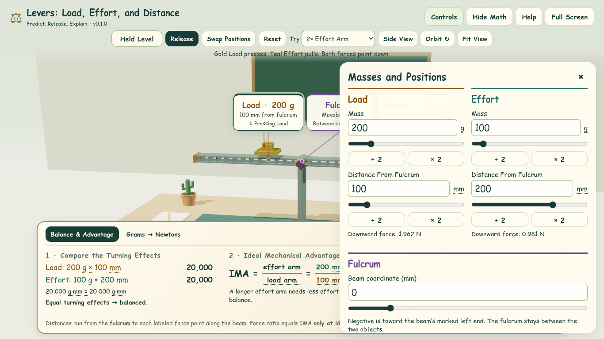
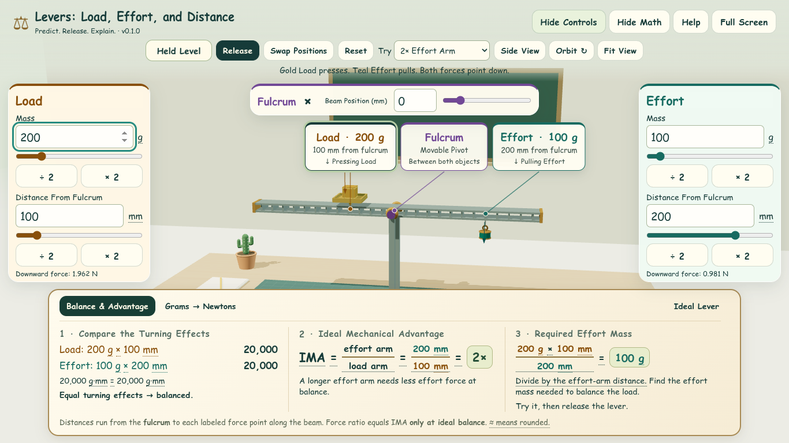
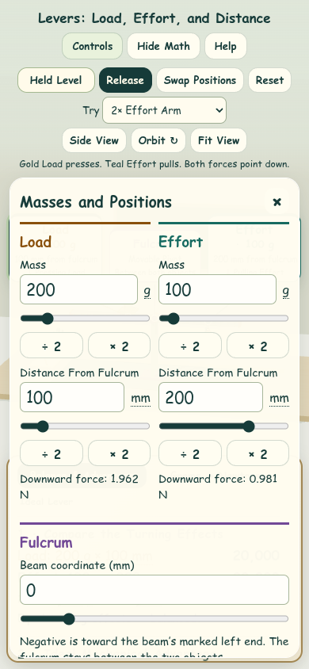
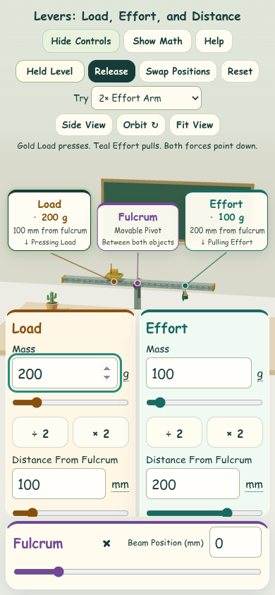

# Split Control Layout Review

Implements [Issue #7](https://github.com/AbbyUsesAIThatCodes/LeversLoadEffortDistance/issues/7).

The former Masses and Positions overlay covered much of the lever. Load and
Effort now have separate gold and teal panels at opposite screen edges, with a
compact shared fulcrum strip. Each panel keeps its mass, distance, sliders,
halve/double shortcuts, units, and downward force reading.

## Behavior

- Panel order comes from the current Load and Effort beam coordinates. Existing
  panel nodes are reordered, so visual and keyboard order agree. Presets, Reset,
  repeated swaps, restored arrangements, and the diagram fallback use that same
  path. Camera orbit does not change panel order or role identities.
- Opening Controls focuses the left panel's first input and resets panel scroll.
  Closing returns focus to Controls. Swap Positions retains focus on its button.
  Escape dismisses a tooltip or Help before closing underlying controls.
- Phones and portrait tablets use two columns in a bottom dock with a shared
  scrolling area and a fulcrum strip beneath. Role headings stay visible while
  scrolling. The dock temporarily replaces math; closing restores the previous
  math preference, and Show Math closes the dock directly.
- Desktop cards scroll if space is limited. Short landscape screens keep the
  cards at the edges and place the fulcrum strip below the central apparatus.
  Floating labels stay between the side panels. None of these overlays resizes
  the rendering canvas or changes the camera or object coordinates.
- Explanatory text from the old large overlay is retained in Help. The shared
  coordinate note is also associated with the fulcrum inputs for assistive
  technology. Physics, swap semantics, saved-state format, and object geometry
  are unchanged.

## Before and After

Both comparisons use the default held arrangement, default camera, and open
controls. Before images are from `798b6fd` (main before this change); after images
are from this PR. Screenshots use Chromium 153 with software WebGL.

| View | Before | After |
| --- | --- | --- |
| Desktop · 1366 × 768 |  |  |
| Compact · 390 × 844 |  |  |

## Verification

Run `npm test`, `npm run build`, and `npm run test:browser`.

The browser suite now checks role panel order and distance values whenever it
reads an arrangement. This covers unequal masses/arms, off-center swaps,
presets, Reset, repeated swaps, reload, extreme saved arrangements, and fallback
controls. Focused checks also cover keyboard traversal before/after swapping,
role colors, rear camera views, closing/focus restoration, touch taps on numeric
shortcuts and range tracks, and math visibility restoration.

Layout checks cover 1366 × 768, 1024 × 768, 768 × 1024, 390 × 844, 360 × 800,
and 844 × 390. They check panel order, horizontal fit, reachable controls, the
central interaction area, and unchanged full-window canvas dimensions. Existing
checks also verify projected object coordinates do not change when panels toggle.
Screenshots from the browser suite go to ignored `artifacts/`.

Local results: all seven model/geometry tests, the production build, and the
expanded Chromium browser suite pass. No new dependencies are needed. WebGL
context loss and startup without WebGL or storage remain covered.

Physical classroom touch hardware, screen readers, and Firefox/Safari have not
been tested here; those remain part of Issue #3. The separate load geometry,
broader tooltip cleanup, and camera-framing work are outside Issue #7.
