# Load Contact Review

Implements [Issue #8](https://github.com/AbbyUsesAIThatCodes/LeversLoadEffortDistance/issues/8).
Verified September 27, 2026 using Node.js 24.19.0, Playwright 1.58.2, and
Chromium 153.0.8010.0 with software WebGL.

## Geometry and Teaching Representation

The gold crate sits directly on the top rail. Its local bottom is the scale
origin, so changing mass preserves contact. Its attachment rotates with the
beam and fixes its selected coordinate; no tray, stem, or raised restraint is
needed. The hanging teal Effort keeps its existing vertical orientation.
Force arrows have independent vertical frames anchored at the labeled
beam-axis points. The SVG diagram likewise rotates only the crate, keeping
its base on the beam's top edge and leaving the Effort and arrows vertical.

The model deliberately retains ideal vertical point loads at the labeled
beam-axis coordinates. A tilted crate's rendered center of mass is offset from
that point; its additional torque is **not** simulated. Help, the Load tooltip,
README, model comments, and [Model and Teaching Notes](MODEL-AND-TEACHING.md)
explain that distinction. The established level-balance experiments, mass × arm
comparisons, IMA, and required-effort calculations are unchanged.

## Before and After

The baseline is `7dcd0d5` (merged PR #11). Each pair uses identical saved state,
viewport (1366 × 768), and Side View camera. Existing camera settings are retained
so the contact/rotation change can be compared directly.

- **Level:** default 200 g Load at −100 mm, 100 g Effort at +200 mm, fulcrum 0 mm.
- **+12°:** 1,000 g Load at −250 mm, 25 g Effort at +250 mm, fulcrum −175 mm.
  This combines maximum crate size with the minimum 75 mm Load arm.
- **−12°:** swap those exact object positions and retain the same masses and
  fulcrum. The Load is now on the right with a 425 mm arm.

| View | Before | After |
| --- | --- | --- |
| 3D, Level | 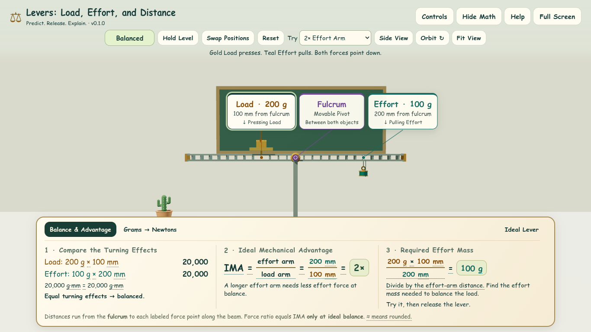 | 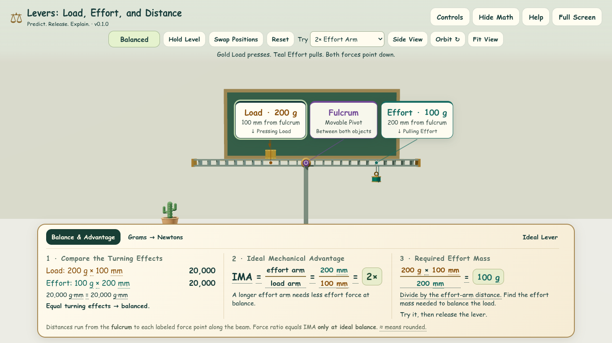 |
| 3D, +12° | 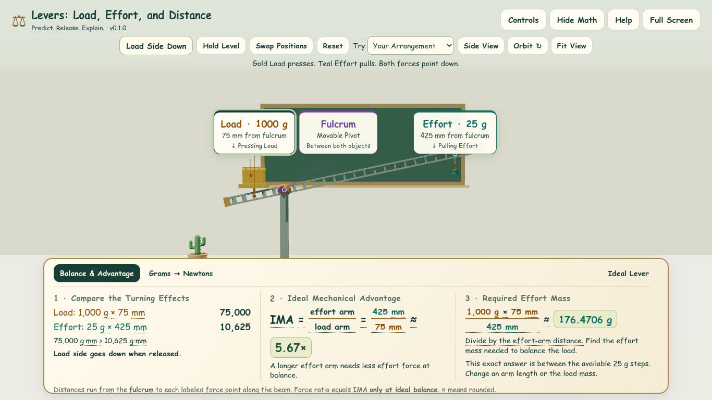 | 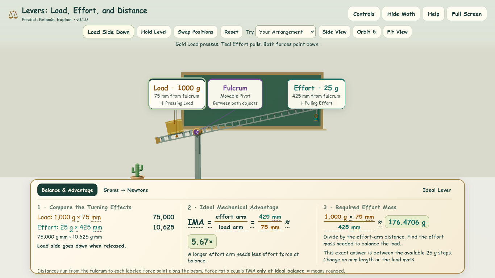 |
| 3D, −12° | 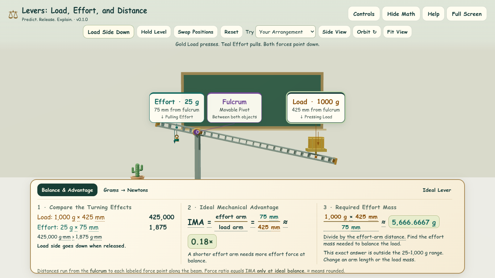 | 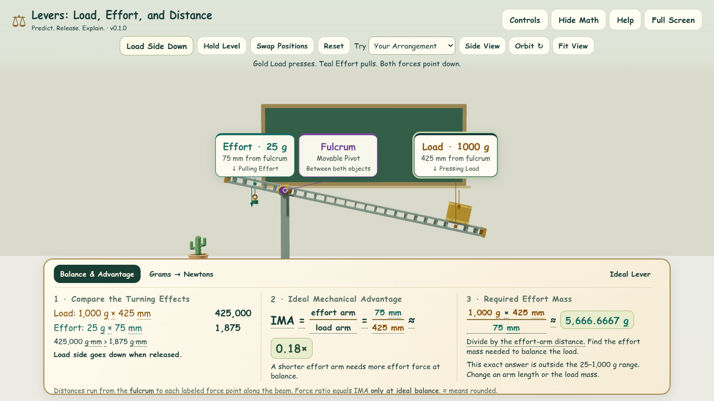 |
| Diagram, Level |  | 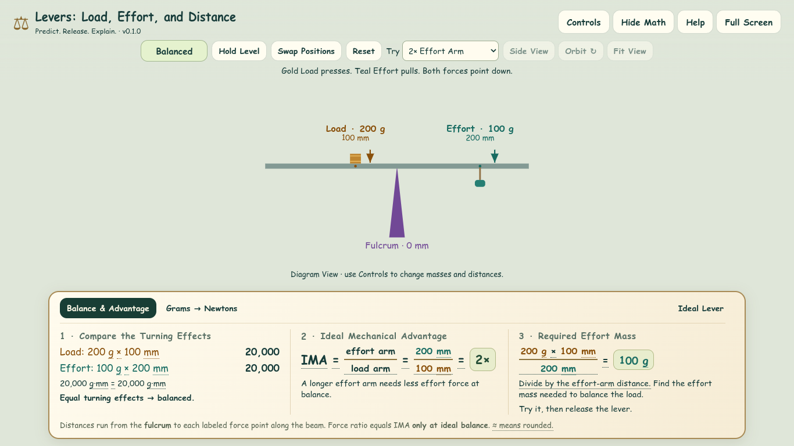 |
| Diagram, +12° | 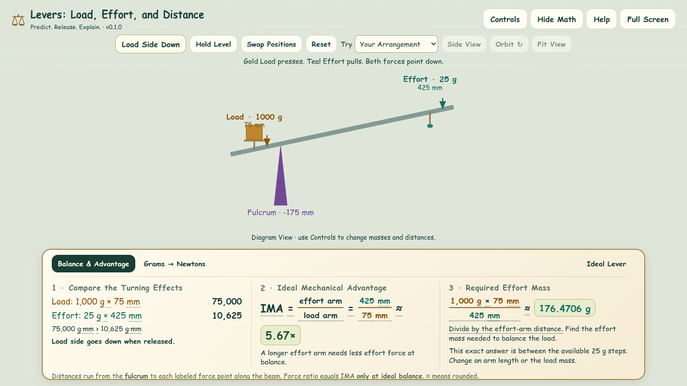 | 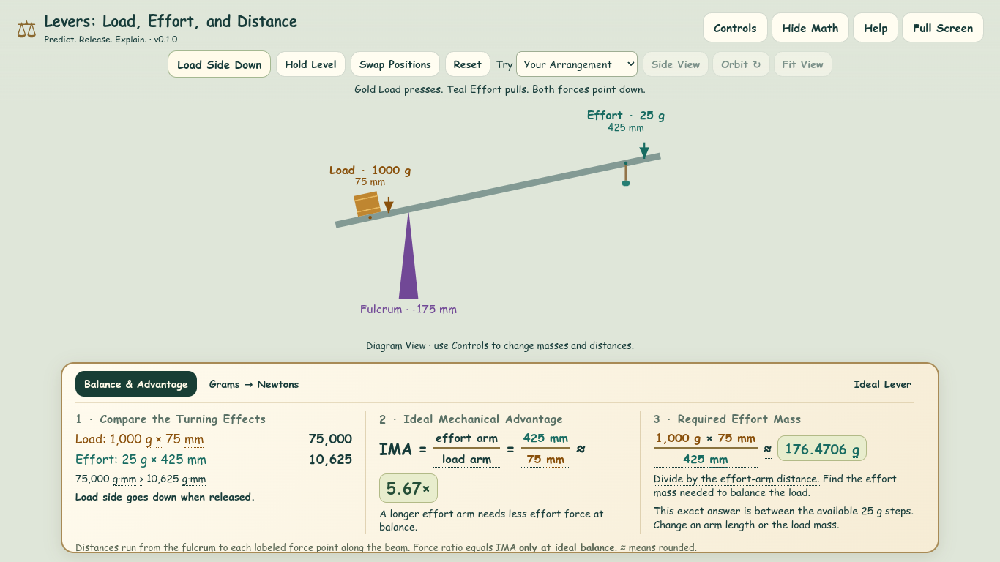 |
| Diagram, −12° | 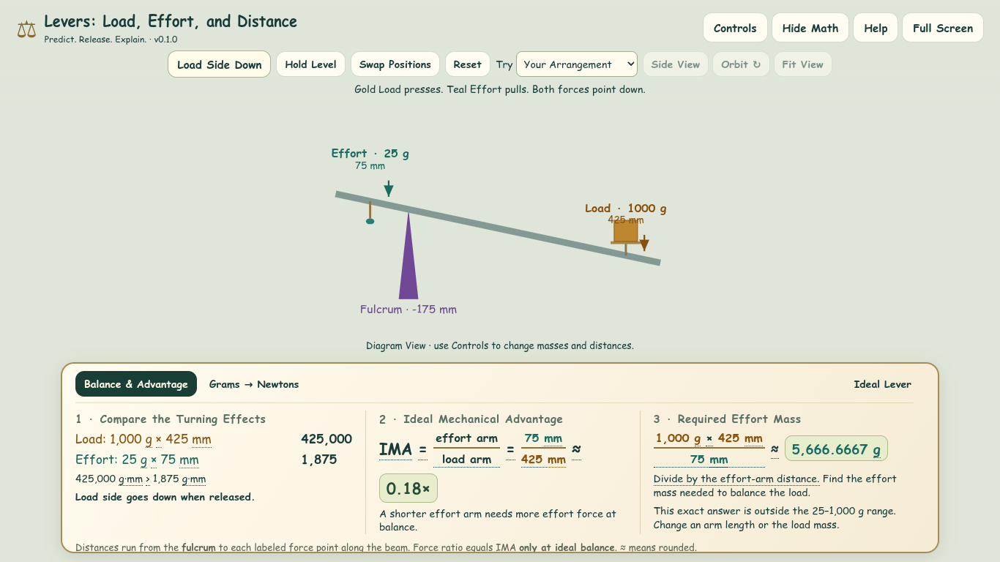 | 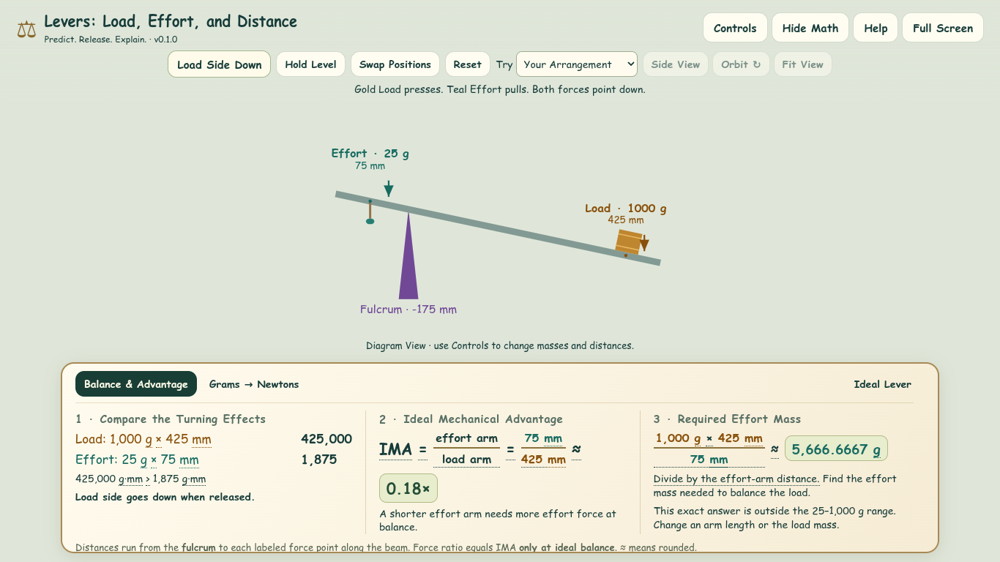 |

## Verification

| Check | Result |
| --- | --- |
| `npm test` | Eight tests pass, including the existing 1,360-coordinate-state model checks. |
| Actual 3D Geometry | 1,600 distinct combinations: every supported Load mass (25–1,000 g), maximum Effort mass, level/±6°/±12°, both role orientations, end positions, minimum arms, and off-center fulcrums. |
| Contact and Clearance | Both crate base edges remain on the actual top-rail plane. Crate bands stay above the rail; the whole footprint stays within its length. Both weights clear the support, beam/attachments clear the desk, and the hanging weight clears the beam. |
| Orientation and Model | Crate and beam world rotations match. Effort and arrows remain vertical; arrow direction is downward. Torque from the rendered beam-axis anchors agrees with the model, while a separate check confirms the tilted crate center is intentionally different. |
| Identity and Interaction | Mesh identity, color, dimensions, mass, and picking survive two swaps. Browser checks drag the actual seated crate and confirm exact state restoration after swaps. |
| `npm run build` | Self-contained static build passes; no new game dependency. |
| `npm run test:browser` | Passes: existing model/UI/save, keyboard/numeric/drag/touch, responsive layouts, WebGL loss, and no-WebGL/storage checks. New SVG checks measure rendered base-to-rail contact and vertical Effort/force vectors at level and both stops, including minimum/maximum crate sizes. |
| Visual Review | Level and both stop comparisons, extreme arrangements, phone/landscape layouts. Direct contact remains visible in 3D and the diagram. |

The normal Playwright browser download was unavailable. A separately installed
Chromium executable supplied through `CHROMIUM_EXECUTABLE` ran the tests; this
workaround is outside the repository and does not change the game dependencies.

## Reproduce the Screenshots

After building the revision being captured:

```sh
npm run build
BROWSER_SOFTWARE_GL=1 node tests/capture-load-contact.mjs after
```

Use `CHROMIUM_EXECUTABLE=/path/to/chromium` if needed. The script writes six PNGs
to ignored `artifacts/load-contact/`. To reproduce the baseline, run the same
script against a build of `7dcd0d5` and pass `before`. The committed screenshots
above preserve both runs without altering the historical core screenshots.

Native classroom hardware, touch hardware, screen readers, and other browsers
remain part of the classroom verification in Issue #3. This PR does not merge
or deploy the change.
