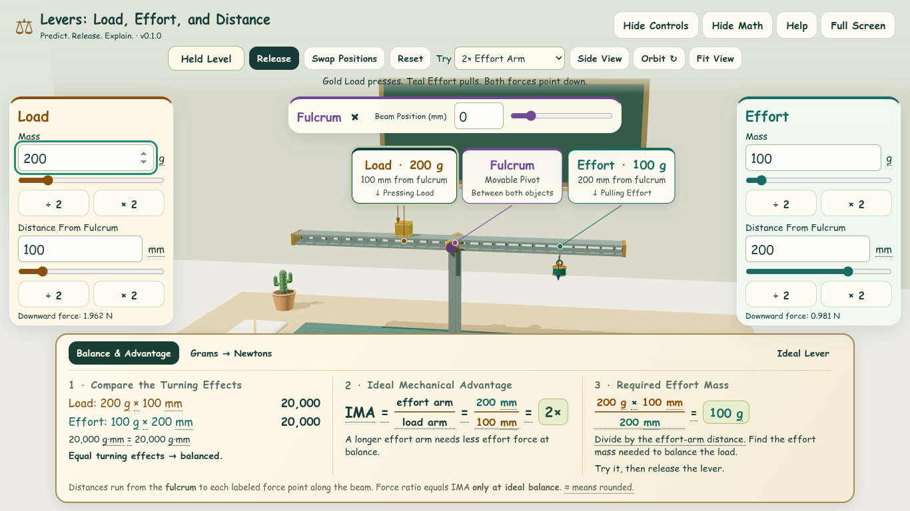
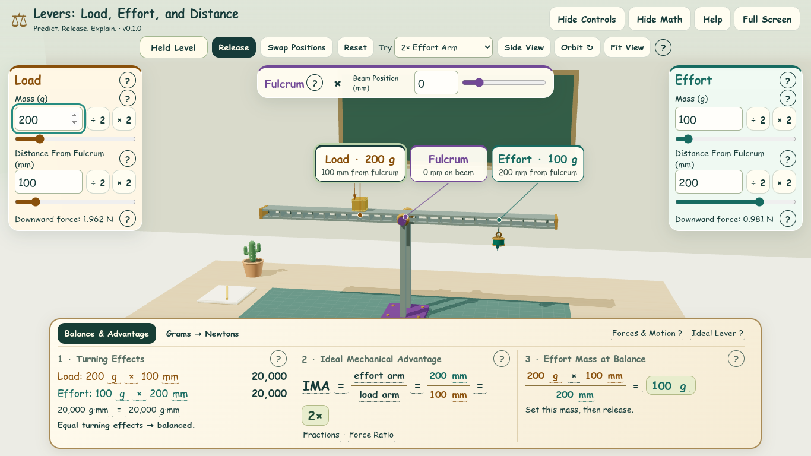
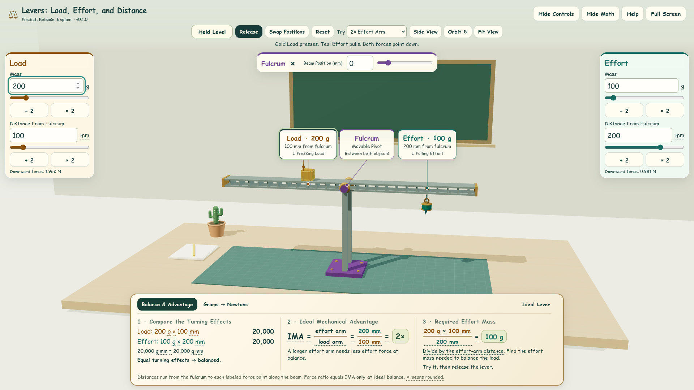
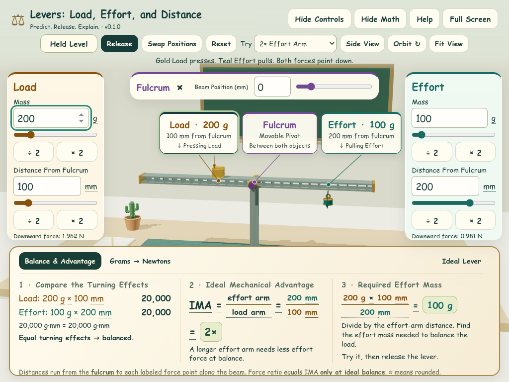
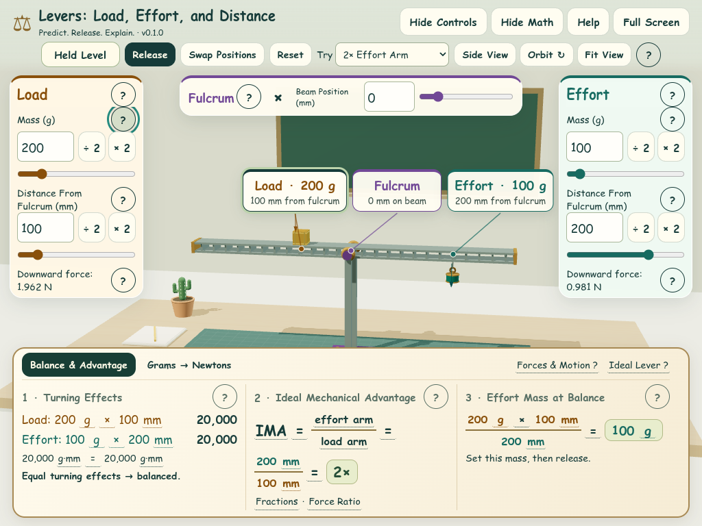

# Compact Menus and Tooltip Review

Implements [Issue #9](https://github.com/AbbyUsesAIThatCodes/LeversLoadEffortDistance/issues/9).

The toolbar, role cards, apparatus labels, and math panel now leave more of the
lever visible. Each role card places its number field and halve/double shortcuts
on one row. Units, mass and arm labels, downward force readings, live equations,
balance feedback, and actionable range/step messages remain visible.

## Where the Explanations Went

| Explanation | Compact Access |
| --- | --- |
| Load, Effort, grams, and arm length | Named **?** buttons beside role headings and quantity labels |
| Both forces point down, even when motion goes up | **Forces & Motion ?** and help beside each downward force reading |
| Dragging, keyboard movement, and swapping | Toolbar **?**; full **Help** remains in the header |
| Negative beam coordinates and fulcrum limits | **?** beside Fulcrum; existing input descriptions remain attached |
| Turning effects and the mass × distance shortcut | Turning Effects **?**, units, and operation symbols |
| IMA, fractions, and force ratio only at ideal balance | IMA, arm terms, **Fractions**, and **Force Ratio** |
| Required effort mass and how to try it | Effort Mass at Balance **?**; actionable step/range feedback remains inline |
| SI conversion, torque at level, and rounding | Grams → Newtons terms, **Torque at Level**, and **Rounding** |
| Massless components, point load, tilt, and illustrative motion | **Ideal Lever ?**, with fuller detail in **Help** |

## Interaction and Accessibility

The existing mechanism in `src/math.js` owns all tooltips. A single fixed
`role="tooltip"` layer sits outside scrolling panels. Only the current trigger
is associated with that layer. Triggers are native buttons, with accessible
names and persistent descriptions available before focus; opening and closing
help preserves other descriptions such as the fulcrum note. Fraction containers
are no longer focusable parents around other interactive terms.

- Hover or keyboard focus opens a tooltip. Moving onto its text keeps it open;
  leaving the pointer does not dismiss help while its trigger retains focus.
- Click, tap, Enter, or Space pins it. Repeating that action closes it. Another
  help trigger replaces it, and an outside click/tap dismisses it.
- Escape dismisses the tooltip and preserves focus. A second Escape can close
  the underlying Controls panel. Opening full Help, changing math tabs, editing
  the model, resizing, or scrolling the containing panel clears stale help.
- Tooltips stay within the visible viewport; long text can scroll inside the
  tooltip without dismissing it. They can be selected and read without a timer.
- Help buttons sit outside input labels and draggable apparatus labels. Opening
  one cannot activate a quantity field, scale a mass, release the lever, or
  initiate a drag. Toolbar and diagram controls use the same mechanism.

The interaction follows the [W3C hover/focus guidance](https://www.w3.org/WAI/WCAG22/Understanding/content-on-hover-or-focus.html)
and the [ARIA tooltip pattern](https://www.w3.org/WAI/ARIA/apg/patterns/tooltip/).
This is a tested interaction design, not a claim of a complete accessibility audit.

## Measured Footprint

Default held arrangement, open Controls, Balance & Advantage, Chromium software
WebGL. Measurements are CSS pixels, rounded to the nearest pixel. Before images
use `b6c20be`; after images use this change. Camera/model behavior is unchanged.

| View | Toolbar Height | Math Height | Each Role Card (Width × Height) |
| --- | --- | --- | --- |
| Laptop · 1366 × 768 | 141 → 106 | 255 → 220 | 246 × 344 → 226 × 279 |
| Projector · 1920 × 1080 | 141 → 106 | 255 → 220 | 246 × 348 → 226 × 279 |
| Compact Touch · 1024 × 768 | 141 → 106 | 261 → 249 | 195 × 338 → 195 × 325 |

At the laptop size, the vertical space between toolbar and math increases by
about **70 px**. Default math fits without vertical scrolling. Touch checks use
a laptop-sized viewport; new review screenshots do not target phones. Coarse
pointers get larger help triggers and 44 px number/shortcut controls.

| View | Before | After |
| --- | --- | --- |
| Laptop |  |  |
| Projector |  |  |
| Compact Touch |  |  |

Additional review images:

- [Keyboard Tooltip](screenshots/issue-9/keyboard-tooltip.png)
- [Touch Tooltip](screenshots/issue-9/touch-tooltip.png)
- [Grams → Newtons](screenshots/issue-9/force-math.png)
- [Non-WebGL Diagram](screenshots/issue-9/after-fallback.png)

## Verification

Run `npm test`, `npm run build`, and `npm run test:browser`.

The browser suite includes `tests/tooltips-browser.mjs`: hover persistence,
pointer travel, focus retention, keyboard activation, Escape ordering, tap
toggling, outside dismissal, existing description preservation, one active
tooltip, viewport bounds, scrolling-panel isolation, full Help, tab changes,
model rerenders, and unchanged apparatus state. It covers both WebGL and the
non-WebGL diagram. Existing model, geometry, swapping, save/restore, drag,
continuous-motion, and full-window canvas checks remain in the normal suite.

Screenshots and measured bounds are regenerated in `artifacts/issue-9/` by the
browser suite. Selected review images are checked in here.

Physical classroom touch hardware, screen readers, and Firefox/Safari remain
unverified locally and belong to the classroom checks in Issue #3.
